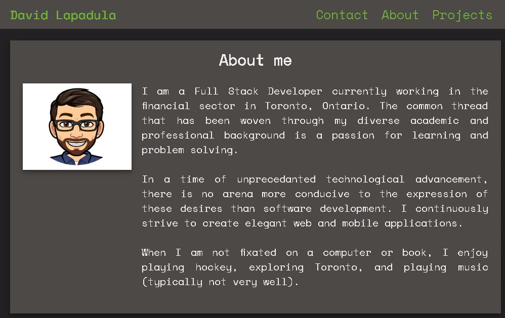
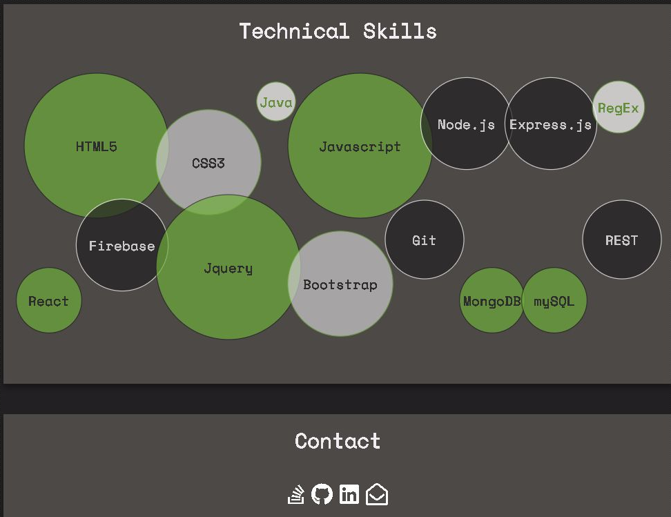

## Portfolio Page Update
After completing some additional Projects, decided to update my portfolio page. I went for a simple and intuitive design. 

## Motivation
Whenever I have completed a few projects, I enjoy showcasing them in my personal portfolio. Moreover, this gives me the opportunity to work on my development skills. 

A more polished version is currently in the works!

## Screenshots
   
    
   

## Tech/framework used
* HTML5
* CSS3
* Javascript

## Features
I am very glad to have found a way to demonstrate what skills I possess and my proficiency in them without using a generic graph display. The circles provide a aesthetically pleasing way to accomplish this goal. 

## Code Example
For anyone looking to implement this bubble design: 

* Create classes in your CSS with proeprties that make circles of various sizes.
* Make Div for each item you want represented. 
* Apply the class to each Div that corresponds to the circle size you want to displa. 

